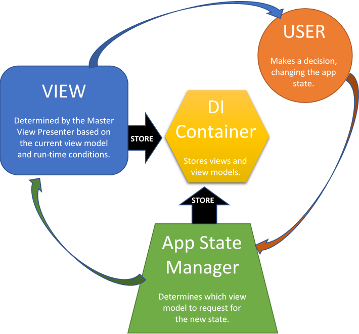

# Keeping MVVM Truly Light

A common interview question is, <I>"What MVVM frameworks do you rely on for creating Xamarin apps?</I>" I simply respond, <I>"Whatever we have learned over time is, in effect, our framework."</I> This always evokes a puzzled expression.  Most IT managers, and many architects, assume that all they have to do is drop a quarter into a vending machine, grab a cute and tasty MVVM Framework, and wa-la! Instant gratification. Could so many programmers be <B><I>wrong?</I></B>

Yup. And lazy.

## MVVM Frameworks Are a Mega-Tsunami Sandwich</BR>With a Shark-Nado on the Side

In the name of making something simpler, an MVVM framework creates a new layer on top of Xamarin. The creators claim this: so you can't build an airplane because it's too complicated? No problem!  I'll take your car and turn it into an airplane!


When you try to implement this "easy" approach, you find that:
> * Every button, pedal, or lever is attached to another device that you have to learn to push, and that feels klunky
> * The moving parts went up by 3x. You don't understand any of them.
> * The thing drives a lot worse
> * The thing barely flies; nobody is suicidal enough to volunteer to be the "test" pilot.

<B><I>To translate:</I></B> The MVVM framework is telling you: <I>"just create a website and we'll convert it into a Xamarin app"</I>.

Here's what the framework really is:

* A black box full of assumptions that you would not undertand if you were a Tibetan monk with a hundred years to read them.
* <B><I>Massive!</I></B> The most famous MVVM framework contains <B><I>two million lines!</I></B>
* Much harder to use than you could imagine, and way more time-consuming. One Fortune 50 company recently adopted an MVVM framework to ensure that they could deliver their app in one year and at a cost of $15 million. They ended up taking <B><I>three</I></B> years and <B><I>$45 million</I></B>, and the app was total crap!  
* Inflexible; buggy; ugly; stiff; not user-friendly.

MVVM Frameworks do their "magic" by breaking every rule in the book regarding behavioral C# and Xamarin.  See my complete analysis <B>[here](https://marcusts.com/2018/04/06/the-mvvm-framework-anti-pattern).</B>

## Do Anyone Actually Need an MVVM Framework?

Nope.

Look at the <B>[ModernAppDemo](https://github.com/marcusts/Com.MarcusTS.ModernAppDemo)</B>.  It's everything I have learned since starting Xamarin. How does it accomplish a safe, reliable, faithful interpretation of MVVM?



Here's the coding side of this diagram:

### VIEW
The MasterViewPresenter sets the view based on the view model and various run-time conditions:

<font size="2">
    
```csharp
protected override async Task RespondToViewModelChange(object newModule)
{
    if (newModule is IDashboardViewModel)
    {
        await ChangeContentView<IDashboardTitledFlexViewHost,         DashboardTitledFlexViewHost>(newModule)
        .WithoutChangingContext();
    }
    else if (newModule is ISettingsViewModel)
    {
         await ChangeContentView<ISettingsTitledFlexViewHost, SettingsTitledFlexViewHost>(newModule)
         .WithoutChangingContext();
    }
    else if (newModule is IAccountsViewModel)
    {
         await ChangeContentView<IAccountsTitledFlexViewHost, AccountsTitledFlexViewHost>(newModule)
         .WithoutChangingContext();
    }
    else if (newModule is ILogInViewModel)
    {
         await ChangeContentView<ILogInTitledFlexViewHost, LogInTitledFlexViewHost>(newModule)
         .WithoutChangingContext();
    }
    else if (newModule is ICreateAccountViewModel)
    {
         await ChangeContentView<ICreateAccountTitledFlexViewHost, CreateAccountTitledFlexViewHost>(newModule)
         .WithoutChangingContext();
    }
    else if (newModule is ICreationSuccessViewModel)
    {
         await ChangeContentView<ICreationSuccessTitledFlexViewHost, CreationSuccessTitledFlexViewHost>(newModule)
         .WithoutChangingContext();
    }
}
```    
</font>
    
<B><I>NOTE:</B> The call to <B>ChangeToolbarState</B> is a base class method from the <B>[XamFormsSupport](https://github.com/marcusts/Com.MarcusTS.ResponsiveTasks.XamFormsSupport)
    )</B> library, which we import here.</I>    
    
### VIEW
The AppStateManager sets the view model based on the "current app state", which is arrived at by respoding to the user's decisions.
    
<font size="2">
    
```csharp
protected override async Task RespondToAppStateChange(string newState, bool andRebuildToolbars = false)
{
    switch (newState)
    {
        case DASHBOARD_APP_STATE:
            await ChangeToolbarViewModelState<IDashboardViewModel, DashboardViewModel>(newState)
            .WithoutChangingContext();
            break;

        case ACCOUNTS_APP_STATE:
            await ChangeToolbarViewModelState<IAccountsViewModel, AccountsViewModel>(newState)
            .WithoutChangingContext();
        break;

        case SETTINGS_APP_STATE:
            await ChangeToolbarViewModelState<ISettingsViewModel, SettingsViewModel>(newState)
            .WithoutChangingContext();
        break;

        case SIGN_IN_APP_STATE:
            await RequestLogin().WithoutChangingContext();
        break;

        case CREATE_ACCOUNT_APP_STATE:
            await ChangeLoginViewModelState<ICreateAccountViewModel, CreateAccountViewModel>(
            CREATION_SUCCESS_APP_STATE,
            SIGN_IN_APP_STATE,
            ServiceDateIsValidAndUserCanBeSaved)
            .WithoutChangingContext();
            break;

        case CREATION_SUCCESS_APP_STATE:
            await ChangeLoginViewModelState<ICreationSuccessViewModel, CreationSuccessViewModel>(
            SIGN_IN_APP_STATE, 
            NO_APP_STATE)
    .WithoutChangingContext();
            break;
            
        case LOGOUT_APP_STATE:
            // TODO - Log out physically -- ??
            await RequestLogin().WithoutChangingContext();
            break;
    }
}    
```
    
</font>
    
<B><I>NOTE:</B> The call to <B>ChangeContentView</B> is also a base class method from the <B>[XamFormsSupport](https://github.com/marcusts/Com.MarcusTS.ResponsiveTasks.XamFormsSupport)
    )</B> library.</I>
    


