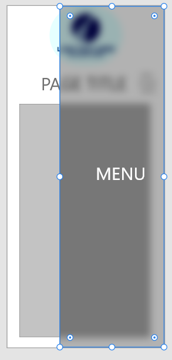
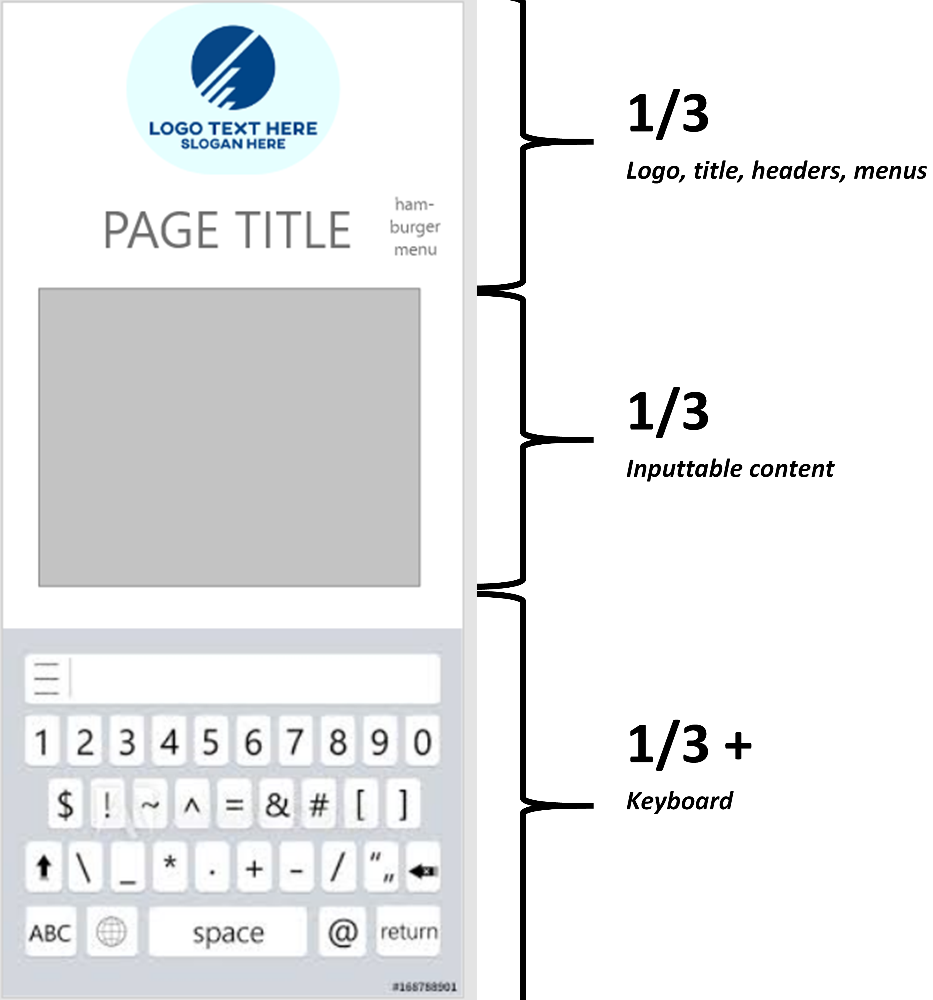
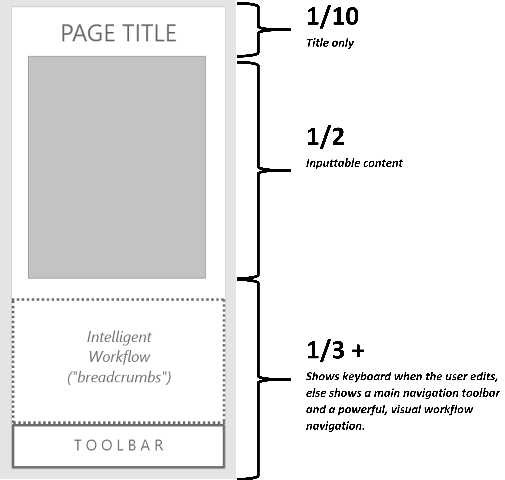

# The "Navigationless" UI

## What's Wrong

Xamarin's creators wanted to create apps, but didn't fundamentally understand them.  So when it came to navigation, they implemented what they knew: a web-like UI with irritating and antiquated features:

* A large hamburger menu that drags open and <B>covers the screen</B>, causing a loss of <B><I>scope</I></B>.  The user feels "lost" whenever the menu is pen.
* <B>Page-based</B> navigation, so after the user selects a menu item, the entire app screen refreshes.  The existing page is destroyed. A new page blows into place, usually with the same basic structure.
* All views and edits occur on a massive scale -- an <B>entire page</B> -- as there is no nuanced understanding of a page being made of parts, and those parts made of other parts.
* The gargantuan pages are stored redundantly in a back-stack so as if the user hits the back button, the page(s) can be retrieved in reverse order according to how they were originally shown. This sounds intuitive, but is a functional <B><I>disaster</I></B>. Imagine this scenario:

    > - The user selects <B>Accounts</B> from the menu.  This was a mistake.  They meant to tap <B>Settings</B>. 
    > - The user then selects <B>Settings</B> from the menu.  But they forgot which setting they wanted to change.
    > - The user selects <B>Help</B> from the menu to find out more about settings.
    > - The user selects <B>Settings</B> from the menu again and makes a change.  But they're not sure if it took hold.
    > - The user selects <B>Dashboard</B> to see if the setting took hold.  I didn't. Apparently, they made another mistake. <I>(For the record: this happens all day long in a user app.)</I>
    > - The user selects <B>Settings</B> from the menu for a third time and fixes the issue.
    > - The user selects <B>Dashboard</B> and confirms that all is good finally.
    > - The user selects <B>Accounts</B> from the menu and reviews those.
    

Now here comes the fun part: the user wants to "go back" in their workflow, so they start hitting the BACK button.  Here's what happens:    
 
 
<I>{Starting at Accounts}</I>
 
 
   
1. Dashboard -- <B><I>OK</I></B>, worked as expected.
2. Settings -- <B><I>??? - not</I></B> where they wanted to go. They just need to see what functional steps they took -- not the errors they fixed.
3. Dashboard -- <B><I>Weren't they just here a minute ago?</I></B> Confusion sets in.
4. Settings -- <B><I>Yikes, again ???</I></B>
5. Help -- Yup. Need help. <B><I>Need aspirin.</I></B>
6. Settings -- OK, <B><I>never</I></B> going there again...
7. Accounts -- Right back to where they started.  That's <B><I>perfect</I></B>.

Back navigation is inherently <B><I>masochistic</I></B> for this reason.  Of course, the MVVM framework folks have a solution: remove redundancy from the back-stack. So the back navigation ends up looking like this:

<I>{Starting at Accounts}</I>
    
1. Dashboard
2. Settings
3. Help
4. Accounts

Does this really make a lot more sense?  The user now has <B><I>false</I></B> back navigation, not really reflecting their steps, but including <B><I>all</I></B> of their mis-steps -- just <B><I>once each</I></B>.

## Old-Style App Design

This is a typical old-fashioned app design.  Note that the keyboard is open, which occurs whenever the user can edit.

Not only is the page used inefficiently.  It is also blown away and replaced constantly.

## The New One-Page App

Design is a beautiful thing, bit a cruel task-master.  Design requires us to abandon what we think we know about something and to restart with only <B>design principles</B> in mind: how to do a thing elegantly and wit the least effort.  A this point, the page concept itself comes into question.  After all, isn't the app just a single page fundamentally?  If the page has a title and a toolbar, why destroy that to do something similar?

In this new approach, the logo is removed; navigation is bottom-centric; there are no general menus; the workflow area has grown abundantly.  This page is designed to be used universally for all sub-views; it is never replaced except at login.

