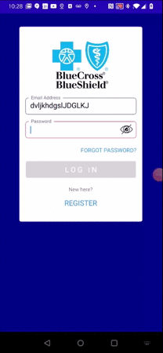
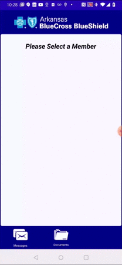

# Engaging the User with Animations

In the modern age, users don't want a desktop or even a laptop app. They want a <I>personal assistant</I>. This is still an illusion, of course. iPhone's Siri is far less coherent than a child. So apps become more personal through subtle audio-visual "tricks".  As the user sees and touches the app, they are constantly rewarded, making them feel that they are being "served".

## Simple Animations

### Button Taps

The easiest way to introduce animations into an app is at any location where the user taps, sch as buttons.  Add some subtle "haptic feedback" so the user also <B><I>hears</B></I> that they have tapped.

 
 
 
 
 
 
 
 
 
 
 
 
 
 
 
 
 
 
 

## Advanced Animations

### "Flowable" Tiles

In an animated app, pages are abandoned. Instead, we think of collections of tiles.  Each tile represents a complete, atomic piece of a view.  The views are inserted into a single, static main page ("the app").

This leaves us free to animate the tile in using clever techniques.  This enhances the user's sense that <I>"things are being done for them"</I>.  The app is <B><I>responding</B></I> to them.

 
 
 
 
 
 
 
 
 
 
 
 
 
 
 
 
 

### Dynamically Reshaping Tiles

A <I>"tile"</I> is also dynamically resizable and reshapeable. This maintains the user's sense that everything they see if really just a part of am engaging, constantly changing stage that remains stable before them, very much like the stage used for public plays.

See [<B>The New "Navigationless" UI</B>](https://github.com/marcusts/Com.MarcusTS.ModernAppDemo/blob/main/ModernAppDemo_2.md) for more about how this affects the how the user moves from place to place.

 
 
 
 
 
 
 
 
 
 
 
 
 
 
 
 
 

## Complete Flowable App Demo

Here are all of the snippets put together to show you the full user experience for the workflow.

> <B>NOTE:</B> This "flowable" app container is not included in the current <B>Modern App Demo.</B>  Look for it in future releases.

