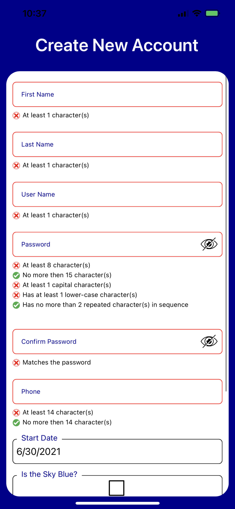

# A Fully Automated ("Viewless") UI<BR/> Using View Model Attributes



This is the [Modern App Demo](https://github.com/marcusts/Com.MarcusTS.ModernAppDemo)'s <B>Create Account</B> View.  There is something quite unusual about it.  It does not contain a "view" in the classical sense. This is how that might look in older-style Xamarin:

<BR/>
<BR/>
<BR/>
<BR/>
<BR/>
<BR/>
<BR/>
<BR/>
<BR/>
<BR/>
<BR/>
<BR/>
<BR/>
<BR/>
<BR/>
<BR/>
<BR/>

This screen leverages a <B>FlexViewWithTasks</B> from the [ResponsiveTasks.XamFormsSupport library](https://github.com/marcusts/Com.MarcusTS.ResponsiveTasks.XamFormsSupport). Here's the source code, digested a bit for clarity:

``` csharp
public class CreateAccountView : FlexViewWithTasks, ICreateAccountView
{
    protected override Task AfterSourceViewsLoaded()
    {
        // Set the comparison validator form the password
        
        ... code removed

        ///////////////////////////////////////////////////////////////////////////////
        Add the save and cancel buttons
        ///////////////////////////////////////////////////////////////////////////////

        var nextTabIndex = MasterAnimatedStackLayoutAsView.SourceViews.Count;
         
        var saveButton =
            CreateButton(
                         "Create Account", 
                         (BindingContext as IWizardViewModelWithTasks)?.NextCommand, 
                         nextTabIndex++, 
                         true,
                         useExtraTopSpace:true);

        MasterAnimatedStackLayoutAsView.SourceViews.Add(saveButton as View);

        var cancelButton =
            CreateButton(
                         "CANCEL".Expanded(), 
                         (BindingContext as IWizardViewModelWithTasks)?.CancelCommand, 
                         // ReSharper disable once RedundantAssignment
                         nextTabIndex++,
                         false,
                         Color.Red, 
                         null, 
                         backColor:Color.Transparent);

        MasterAnimatedStackLayoutAsView.SourceViews.Add(cancelButton as View);

        return base.AfterSourceViewsLoaded();
    }
}
```

The <B>FlexViewWithTasks</B> is a generic view that displays any sort of "tile-like" sub-view that represents a single view model property.  It is only derived for customization. The Create Account View adds a password comparison validator and a few buttons for the user to tap.  That's the entire thing.

The view model is also quite spare:

``` csharp
public class CreateAccountViewModel : WizardViewModelWithTasks, ICreateAccountViewModel
{
    ... code variables omitted
    
    public CreateAccountViewModel()
    {
        Title = "Create New Account";
    }
    
    [CommonViewModelValidations.
    ValidatableTwoWayNonEmptyViewModelValidationAttribute(
    displayOrder: 4, 
    IsPassword = ViewModelValidationAttribute_Static.TRUE_BOOL,
    CanUnmaskPassword = ViewModelValidationAttribute_Static.TRUE_BOOL,
    PlaceholderText = CommonViewModelValidations.CONFIRM_PASSWORD_PLACEHOLDER_TEXT,
    ValidatorType = typeof(ComparisonEntryValidatorBehavior))]
    public string ConfirmPassword
    {
        get => _confirmPassword;
        set
        {
            if (SetProperty(ref _confirmPassword, value))
            {
                VerifyCommandCanExecute().FireAndForget();
            }
        }
    }
    
    ... other properties below
```

Notice that the view model  only sets the property and <I>(if set)</I>, re-checks a command to activate the Submit button once the view has been legally completed by the user.  It doesn't do anything else.  How is that possible?

The answer is <I>attributed programming</I>.  In this case, the custom attribute <B>ValidatableTwoWayNonEmptyViewModelValidationAttribute</B>. That's a long-winded derived atttribute based on the <B>ViewModelValidationAttribute</B> base class:

``` csharp
public class ViewModelValidationAttribute : Attribute, IViewModelValidationAttribute
```

The <B>ViewModelValidationAttribute</B> class declares a property for each of the possible attribute settings.  These include things like the binding mode for the view model, the size and shape of the input field, etc.  The class is not meant to do anything -- only to convert the user settings from the attributed view model into an actual class variable that can be used at run-time.

## The Magic Trick Revealed

Let's return to the automated view producer, the <B>FlexViewWithTasks</B>, to see how it digests an attributed view model.

``` csharp
public class FlexViewWithTasks : 
    ShapeViewWithTasks, 
    IFlexViewWithTasks, 
    IShapeViewBase, 
    ICanSetContentSafely, 
    IProvidePostContentTasks, 
    ICanSetBindingContextSafely, 
    IProvidePostBindingTasks
{
    ... code omitted

    ///////////////////////////////////////////////////////////////////////////////
    This is the ResponsiveTasks equivalent of "Binding Context Changed" -- 
    we call the RecreatUI method.
    ///////////////////////////////////////////////////////////////////////////////
    
    protected virtual async Task HandlePostBindingTask(IResponsiveTaskParams paramdict)
        => await ThreadHelper.WithoutChangingContext(this.RecreateUI());
    
    ///////////////////////////////////////////////////////////////////////////////
    Builds the UI sub-views and adds them to the view's stack layout
    ///////////////////////////////////////////////////////////////////////////////
    private async Task RecreateUI()
    {
        ... code omitted
        
        ///////////////////////////////////////////////////////////////////////////
        Use reflection to grab the custom attributes from the view model
        ///////////////////////////////////////////////////////////////////////////
        var propInfoDict =
          BindingContext.GetType().
          CreateViewModelValidationPropertiesDict<ViewModelValidationAttribute_RTXFS>();

        var retViews = new List<View>();

        if (propInfoDict.IsNotAnEmptyList())
        {
            _nextTabIndex = 0;
            
            ////////////////////////////////////////////////////////////////////
            Create an editable entry (which may or may not be user-editable)
               based on the attributes provided; add the stack layout.
            ////////////////////////////////////////////////////////////////////
            foreach (var keyValuePair in propInfoDict.OrderBy(
               kvp => kvp.Value.DisplayOrder))
            {
                var result =
                    CreateEditableEntry(
                    keyValuePair.Key, 
                    keyValuePair.Value, 
                    _allBehaviors?.Count);
                  
                ... code omitted
            }
        }      
    }
}
```

The method call to <B>CreateEditableEntry</B> is also worth noting, as it in turn calls this method:

``` csharp
public virtual 
    (IValidatableViewWithTasks, ICanBeValidWithTasks, int) 
    CreateValidatableEditorsForAttributeWithTasks
    (
        IHaveValidationViewModelHelperWithTasks viewModel,
        IViewModelValidationAttribute_RTXFS attribute,
        double itemHeight,
        double itemWidth,
        double fontSize,
        ref int nextTabIndex
    )
    {
        ... code omitted
    
        switch (attribute.InputTypeStr)
        {
            case InputTypes_RTXFS.InputTypes_RTFXS_StateInput:
               return SetUpValidatablePicker(FormsUtils.STATIC_STATES, nextTabIndex);
```

The method determines what sort of editor to create based on the input type which is passed in by the view model attribute.

## How (and When) To Use THIS Sort of "Trick"

Philosophically, Xamarin should be made up of MVVM-style <B><I>separated concerns</I></B>.  This approach bends the rules slightly. The view model drives many details about <B><I>how</I></B> the view appears. On the other hand, sometimes the UI view is just a set of rote properties that are mostly similar to each other.  This actually helps the user to understand what to do.  The view model can provide these basic attributes, and the view can be built without the heavy-duty approach that would otherwise be required.  So use this trick for entry/input views such as Login or Create Account.


