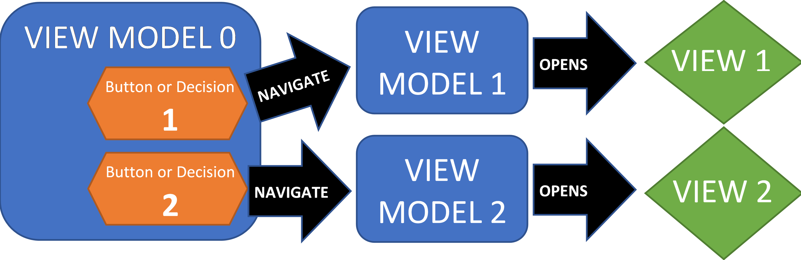

# Isolated, Safe View Models

Ideally, IT philosophy is grounded in <B><I>fundamentals</I></B>.  Unfortuntely, the age f Twitter has crated a new world in whic any idea makes sense as long as it is cute-and-sexy.  Nothing is ever carefully evaluated. Instead, if it's new and cool, and people adopt it, it makes "perfect sense".

## View Models Cannot Know About Other View Models

The latest ugly splotch of bad design is <I>"view model to view model navigation"</I>.  This is promoted by Microsoft Prism, MVVM Cross, and others. The actual source of this misbegotten concept is the advent of <B>page navigation</B> and the associated <B>back stack</B>.  Xamarin adopted this because they only understood "web-like" design concepts. MVVM frameworks have extended this convention it to its nth degree most ridiculous state: view models now know about <B><I>other</I></B> view models.

This approach directly violates C# behavioral guidance:

- No variable can know anything about another variable.  So a view model cannot know to navigate to another view model, since it does not know what that is.

- No view and view model can ever be associated due to MVVM separation principles. So a view model cannot open a specific view.  Any view can show any view model as long they share an <B><I>interface contract</I></B>.  The are never hard-assigned because they have a similar  file name, etc.

- A class must be <B><I>inherently reusable</I></B>.  So a view model cannot navigate because that makes it much less flexible and <I>(probably)</I> totally non-reusable.

