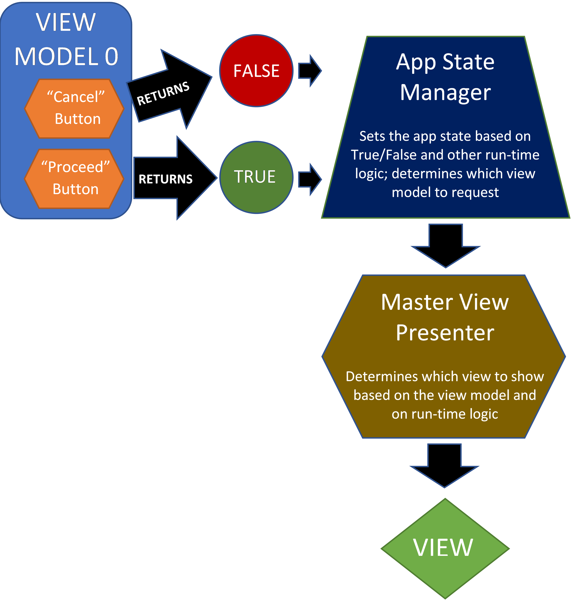

# Isolated, Safe View Models

Ideally, IT philosophy is grounded in <B><I>fundamentals</I></B>.  Unfortunately, the age of Twitter has created a new world in which any idea makes sense as long as it is cute-and-sexy.  Nothing is ever carefully evaluated. Instead, if it's new and cool, and people adopt it, it makes "perfect sense".

## View Models Cannot Know About Other View Models


The latest ugly splotch of bad design is <I>"view model to view model navigation"</I>.  This is promoted by Microsoft Prism, MVVM Cross, and others. The actual source of this misbegotten concept is the advent of <B>page navigation</B> and the associated <B>back stack</B>.  Xamarin adopted this because they only understood "web-like" design concepts. MVVM frameworks have extended this convention it to its nth degree most ridiculous state: view models now know about <B><I>other</I></B> view models.

This approach directly violates C# behavioral guidance:

- No variable can know anything about another variable.  So a view model cannot know to navigate to another view model, since it does not know what that is.

- No view and view model can ever be associated due to MVVM separation principles. So a view model cannot open a specific view.  Any view can show any view model as long they share an <B><I>interface contract</I></B>.  The are never hard-assigned because they have a similar  file name, etc.

- A class must be <B><I>inherently reusable</I></B>.  So a view model cannot navigate because that makes it much less flexible and <I>(probably)</I> totally non-reusable.

## View Models -- The Right Way



Most view models don't have a lot to do with actual workflow.  Most of them have two key buttons near the bottom: <B>Cancel</B> and <B>Continue</B>.  In essence, the view model can be considered to be a Boolean, or perhaps more flexibly, a <B><I>nullable</I></B> Boolean.  This is because the user might navigate away using unexpected or unknown means, closing the view and view model <I>(think of hitting the power button on the phone, or using a toolbar to jump out without notice)</I>.  This third condition would therefore return as <B>null</B>.  Otherwise, the view model would return <B>True</B> or <B>False</B>.  That's all, folks.

</BR>
</BR>
</BR>
</BR>
</BR>
</BR>
</BR>
</BR>
</BR>
</BR>
</BR>
</BR>
</BR>
</BR>
</BR>
</BR>

The <B>App State Manager</B> sets the current view model based on the current <B>app state</B>.  This is just a unique string like <B>LOGIN_STATE</B>, etc.  The Manager also sets the conditions on what app state will be assigned when the new view model returns:

``` csharp
protected override async Task RespondToAppStateChange
(string newState, bool andRebuildToolbars = false)
{
    switch (newState)
    {
        ... code omitted

        case CREATE_ACCOUNT_APP_STATE:
            await ChangeLoginViewModelState
            <ICreateAccountViewModel, CreateAccountViewModel>
            
            ///////////////////////////////////////////////////////////////////////////
            Success = CREATION_SUCCESS_APP_STATE
            Failure = SIGN_IN_APP_STATE (Restart the sign-in process)
            ///////////////////////////////////////////////////////////////////////////
            (CREATION_SUCCESS_APP_STATE, 
            SIGN_IN_APP_STATE,
            
            ///////////////////////////////////////////////////////////////////////////
            Adds a validation condition that must be met by the view model on success.
            ///////////////////////////////////////////////////////////////////////////
            ServiceDateIsValidAndUserCanBeSaved)
            
            .WithoutChangingContext();
            break;

        case CREATION_SUCCESS_APP_STATE:
            await ChangeLoginViewModelState
            <ICreationSuccessViewModel, CreationSuccessViewModel>
            (SIGN_IN_APP_STATE, 
            NO_APP_STATE)
            .WithoutChangingContext();
            break;
                    
        ... code omitted
        
    }
```

This is how the <B>Master View Presenter</B> responds to the change in view model. This class is smart enough to test interface contracts to make decisions.  <B>Remember:</B> this decision tree can be <B><I>much</I></B> more complex in an actual app:

``` csharp
protected override async Task RespondToViewModelChange(object newModule)
{
    if (newModule is IDashboardViewModel)
    {
        await ChangeContentView
        <IDashboardTitledFlexViewHost, DashboardTitledFlexViewHost>
        (newModule).WithoutChangingContext();
    }
    else if (newModule is ISettingsViewModel)
    {
        await ChangeContentView
        <ISettingsTitledFlexViewHost, SettingsTitledFlexViewHost>
        (newModule).WithoutChangingContext();
    }
    
    ... code omitted
}
```

## More Complex View Models

This example shows you how to create a common view model with strict compliance to C# behavioral standards.  If the view model must become more complex -- if it must have more than two decision buttons -- then it an return an enum or other sort of identifier to indicate its ending status.  It will <B><I>never</I></B> navigate.


