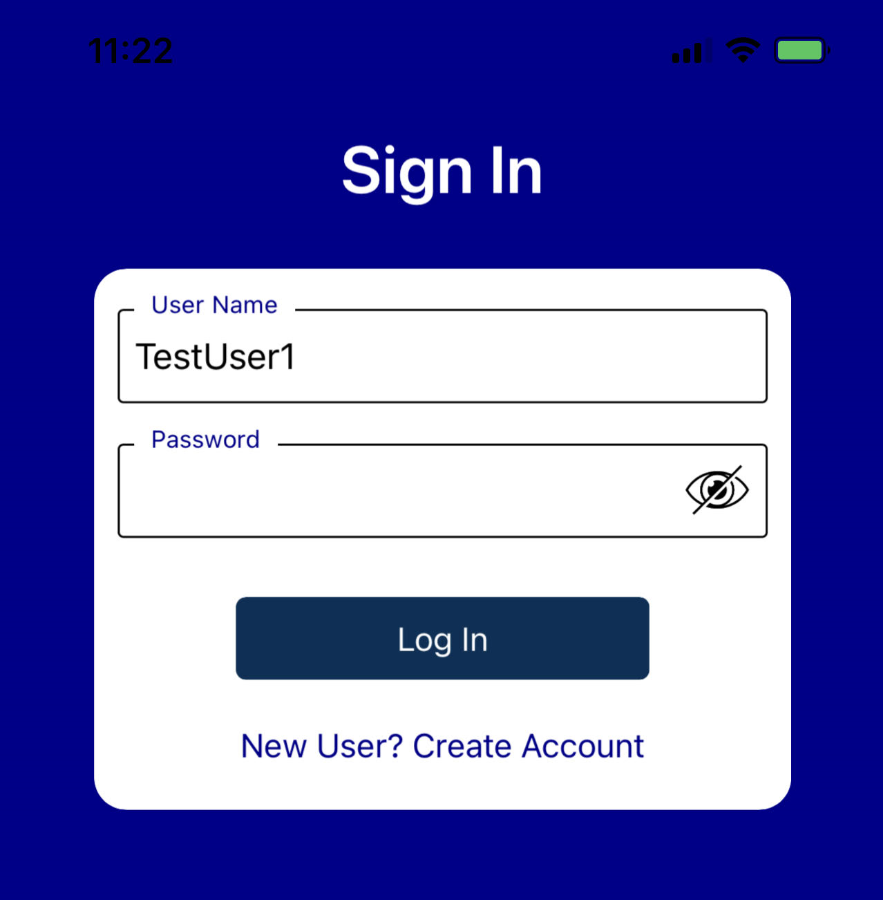
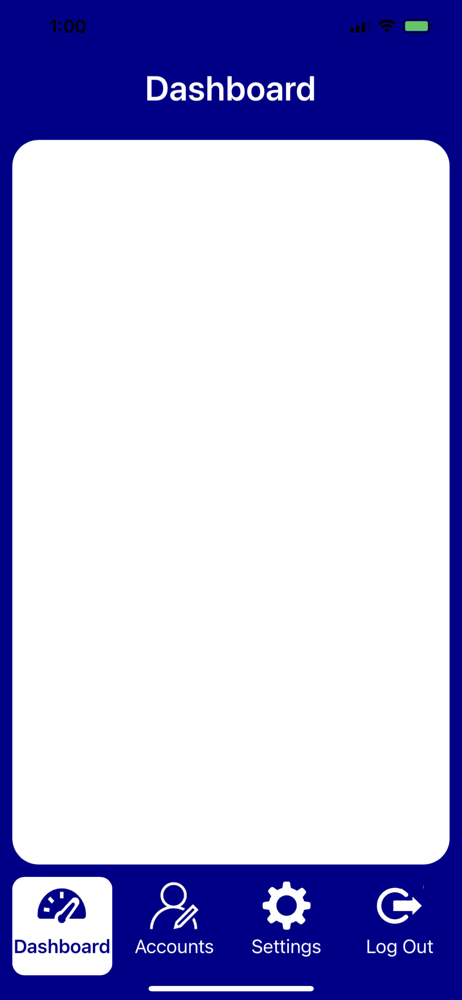

# Custom Controls for Consistency and Reliability

Xamarin made a bold promise when they started: whatever apps they produced would contain only native code, so would be "invisible" to the App Store and the Google Play Store.  This is essentially true, though many critics say that the code is not as efficient in design as native code, so runs more slowly.  Frankly, it seems like a good trade-off for the value received: Xamarin allows us to write apps in C#, an extraordinary, highly organized behavioral language.

## The "Least Common Denominator" </BR> Never Results in Anything Good

The "native" promise was actually taken too far in one regard: Xamarin also uses <B><I>native controls</I></B> to achieve its UI's.  This means that they had to evaluate all similar controls for Android and Apple, determine their common characteristics, and then support <B><I>only</I></B> those specific features that they had in common.

For instance, a commonly used UI element is a <B>Frame</B>. It is a container for almost anything.  It provides a border.  But not a border <B>thickness</B>.  Why?  Because that is not universally supported by Apple and Google.

Another example: the ubiquitous <B>button</B>. The native control for this is not at all the same for the two major platforms.  The differences are so major that if you simply throw a button on a page and add some text to it, it appears differently for iOS and Android. You also cannot manipulate the text in all possible alignments without extreme hassle. 

For the programmer, this sort of oddity means that coding can feel like "death a thousand cuts". UI controls do not work exactly as expected -- or consistently -- for the two platforms.

## Customizing the UI from the Ground Up



The solution is obvious: stop relying on most native controls for Xamarin.  This does not mean that the final code being output is not native. We will only change the UI controls themselves.

Take the Modern App Demo's login screen.  Can you tell what has been customized for safety?

</BR>
</BR>
</BR>
</BR>
</BR>
</BR>
</BR>
</BR>
</BR>
</BR>
</BR>


Only the humble <B>Xamarin.Forms.Label</B> has survived!  Otherwise, we have used what we originally called an open source <B>ShapeView</B> -- a ContentView "frame" that contains anything, and comes with healthy border support. That control was eventually replaced by another open source library called the [PancakeView](https://github.com/sthewissen/Xamarin.Forms.PancakeView), so we just derived that and added some new functionality.  It is still called <B>ShapeView</B> inside our own forms controls libraries: [SharedForms](https://github.com/marcusts/Com.MarcusTS.SharedForms) and [ResponsveTasks.XamFormsSupport](https://github.com/marcusts/Com.MarcusTS.ResponsiveTasks.XamFormsSupport).

</BR>
</BR>
</BR>
</BR>
</BR>
</BR>
</BR>
</BR>
</BR>
</BR>
</BR>

## Styling A Custom Control: The Tri-State Image Label Button



Our custom controls can provide a much cleaner and more consistent UI for your app. But they also provide a much more powerful styling methodology than you would find in old-style Xamarin controls.  Take the TriStateImageLabelButton<I>{WithTasks}</I> from the [ResponsveTasks.XamFormsSupport](https://github.com/marcusts/Com.MarcusTS.ResponsiveTasks.XamFormsSupport) as an example.  This is the "button" you see on the login screen from the earlier screen-shots.  There's an even better example once you log in. From the login screen, type:

>User Name: <B>TestUser1</B>
Password: <B>TestPassword1</B>

The empty Dashboard window opens, revealing a toolbar at the bottom. Each button there is a TriStateImabeLabelButton<I>{WithTasks}</I>.  <I>(The suffix "WithTasks" means that this button leverages the [ResponsiveTasks library](https://github.com/marcusts/Com.MarcusTS.ResponsiveTasks)).</I>

The TriStateImageLabelButton accepts both a image and text, and each can be separately positioned <B><I>anywhere</I></B> accurately using standard alignment techniques ("Start", "End", etc.).  But the beauty part is the concept of button state, with each state being <B><I>completely</I></B> stylable:

``` csharp
public class TriStateImageLabelButtonWithTasks : 
    ImageLabelButtonBaseWithTasks, ITriStateImageLabelButton
{
    public const string DESELECTED_BUTTON_STATE = "Deselected";
    public const string DISABLED_BUTTON_STATE   = "Disabled";
    public const string SELECTED_BUTTON_STATE   = "Selected";
```

Each of the buttons on Dashboard's toolbar derives the TriStatemageLabelButton:

``` csharp
private class ToolBarItem : TriStateImageLabelButton, IToolBarItem
{
    public string SelectionKey { get; set; }
}
```

If you supply a proper binding context that implements <B>IProvideToolbarItemNamesAndSelectionStates</B>, the toolbar auto-constructs after its binding context gets set:

``` csharp
private async Task HandlePostBindingTask(IResponsiveTaskParams paramdict)
{
    if (_lastBindingContext.IsNotNullOrDefault())
    {
        if (_lastBindingContext is IProvideToolbarItemNamesAndSelectionStates _lastBindingContextAsProvidingNames)
        {
            _lastBindingContextAsProvidingNames.IsToolbarVisibleChangedTask
                                                  .RemoveIfThere(this, HandleIsVisibleChangedTask);
        }
    }

    // Must clear all handlers. These are dedicated to the toolbar, so must not be duplicated.
    _bindingContextAsHavingCurrentState?.CurrentStateChangedTask.UnsubscribeHost(this);

    // Might succeed or fail
    _bindingContextAsHavingCurrentState = BindingContext as IHaveAndReportCurrentState;

    _grid.ClearCompletely();

    ////////////////////////////////////////////////////////////////////////////////////////////////
    AUTO CREATION of the toolbar items using the ToolbarItemNamesAndStates
    ////////////////////////////////////////////////////////////////////////////////////////////////
    if (BindingContext is IProvideToolbarItemNamesAndSelectionStates bindingContextAsProvidingNames)
    {
        _toolbarItemNamesAndStates = bindingContextAsProvidingNames.ToolbarItemNamesAndStates;
        bindingContextAsProvidingNames.IsToolbarVisibleChangedTask
                                          .AddIfNotAlreadyThere(this, HandleIsVisibleChangedTask);
        IsVisible = bindingContextAsProvidingNames.IsToolbarVisible;

        await RebuildToolbar().WithoutChangingContext();
    }

    _grid.BindingContext = BindingContext;

    _lastBindingContext = BindingContext;
}
```

Otherwise, you can create your own toolbar by adopting the provided method:

``` csharp
private async Task RebuildToolbar()
{
    if (_toolbarItemNamesAndStates.IsNotAnEmptyList())
    {
        var currentColumn = 0;

        foreach (var nameAndState in _toolbarItemNamesAndStates)
        {
            var nameToLower         = nameAndState.Item1.WithoutSpaces().ToLower();
            var imagePrefix         = ImageResourcePath + nameToLower;
            var imageSelectedPath   = 
                imagePrefix + "_selected" + FormsConst.DEFAULT_IMAGE_SUFFIX;
            var imageDeselectedPath = 
                imagePrefix + "_deselected" + FormsConst.DEFAULT_IMAGE_SUFFIX;

            var toolbarItem =
                new ToolBarItem
                {
                    AnimateButton  = true,
                    BindingContext = BindingContext,
                    
                    /////////////////////////////////////////////////////////////////////
                    Button styles set here
                    /////////////////////////////////////////////////////////////////////
                    ButtonDeselectedStyle =
                        ImageLabelButtonBase.CreateButtonStyle
                            (Color.Transparent, 0f, Color.Transparent),
                    ButtonSelectedStyle = 
                        ImageLabelButtonBase.CreateButtonStyle(
                        Color.White,0, Color.Transparent),
                        
                    ButtonLabel             = 
                        FormsUtils.GetSimpleLabel(nameAndState.Item1),
                    ButtonToggleSelection   = true,
                    CanSelect               = true,
                    CornerRadius            = TOOLBAR_AND_ITEM_RADIUS,
                    GetImageFromResource    = true,
                    HorizontalOptions       = LayoutOptions.FillAndExpand,
                    ImageDeselectedFilePath = imageSelectedPath,
                    ImageResourceClassType  = ImageResourceType,
                    ImageSelectedFilePath   = imageDeselectedPath,
                    ImageHeight             = DEFAULT_IMAGE_WIDTH_HEIGHT,
                    ImageHorizontalAlign    = LayoutOptions.Center,
                    ImageMargin             = 
                    new Thickness(0, -IMAGE_PUSH, 0, IMAGE_PUSH),
                    ImageVerticalAlign      = LayoutOptions.Fill,
                    ImageWidth              = DEFAULT_IMAGE_WIDTH_HEIGHT,
                    IncludeHapticFeedback   = true,
                    LabelDeselectedStyle =
                        ImageLabelButtonBase.CreateLabelStyle(
                            Color.White, LABEL_FONT_SIZE, FontAttributes.None),
                    LabelSelectedStyle =                           
                         ImageLabelButtonBase.CreateLabelStyle(
                             ThemeUtils_RTXFS.MAIN_STAGE_THEME_COLOR, 
                             LABEL_FONT_SIZE, FontAttributes.Bold),
                    SelectionGroup  = MASTER_TOOLBAR_SELECTION_GROUP,
                    SelectionKey    = nameAndState.Item2,
                    SelectionStyle  = ImageLabelButtonSelectionStyles.
                         ToggleSelectionAsFirstTwoStyles,
                    VerticalOptions = LayoutOptions.FillAndExpand
                  };

               // The button label exists because we create in above, 
               //    so we can easily set its properties.
               toolbarItem.ButtonLabel.VerticalTextAlignment = TextAlignment.Center;
               toolbarItem.ButtonLabel.VerticalOptions       = LayoutOptions.Center;
               // Push the label down a bit
               toolbarItem.ButtonLabel.Margin = 
               new Thickness(0, LABEL_PUSH, 0, -LABEL_PUSH);

                ... code omitted

               _grid.AddStarColumn();
               _grid.AddAndSetRowsAndColumns(toolbarItem, column: currentColumn++);
            }

            await SetBottomToolbarHeight(TOOLBAR_HEIGHT).WithoutChangingContext();
        }
    }
}         
```

## Free Custom Controls Provided in the SharedForms Library 

[ResponsveTasks.XamFormsSupport](https://github.com/marcusts/Com.MarcusTS.ResponsiveTasks.XamFormsSupport) provides many custom UI controls.  See the folder path ResponsveTasks.XamFormsSupport.Views/Controls:

- CustomCheckBox<I>{WithTasks}</I>
- EnumPicker<I>{WithTasks}</I>
- ImageLabelButtonBase<I>{WithTasks}</I>
- SimpleImageLabelButton<I>{WithTasks}</I>
- TaskRepeatToggleImageLabelButton<I>{WithTasks}</I>
- CustomCheckBoxTriStateImageLabelButton<I>{WithTasks}</I> -- featured above.
- ValidatableCheckBox<I>{WithTasks}</I>
- ValidatableDateTime<I>{WithTasks}</I>
- ValidatableEntry<I>{WithTasks}</I>
- ValidatableEnumPicker<I>{WithTasks}</I>
- ValidatableNumericEntry<I>{WithTasks}</I>
- ValidatablePicker<I>{WithTasks}</I>
- ValidatableSlider<I>{WithTasks}</I>
- YesNoToggleImageLabelButton<I>{WithTasks}</I>

... plus many base classes where you can easily build your own custom controls .


 
