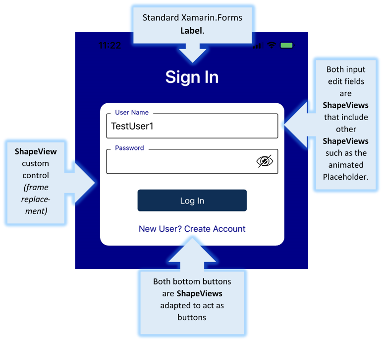

# Custom Controls for Consistency and Reliability

Xamarin made a bold promise when they started: whatever apps they produced would contain only native code, so would be "invisible" to the App Store and the Google Play Store.  This is essentially true, though many critics say that the code is not as efficient in design as native code, so runs more slowly.  Frankly, it seems like a good trade-off for the value received: Xamarin allows us to write apps in C#, an extraordinary, highly organized behavioral language.

## The "Least Common Denominator"   Never Results in Anything Good

The "native" promise was actually taken too far in one regard: Xamarin also uses <B><I>native controls</I></B> to achieve its UI's.  This means that they had to evaluate all similar controls for Android and Apple, determine their common characteristics, and then support <B><I>only</I></B> those specific features that they had in common.

For instance, a commonly used UI element is a <B>Frame</B>. It is a container for almost anything.  It provides a border.  But not a border <B>thickness</B>.  Why?  Because that is not universally supported by Apple and Google.

Another example: the ubiquitous <B>button</B>. The native control for this is not at all the same for the two major platforms.  The differences are so major that if you simply throw a button on a page and add some text to it, it appears differently for iOS and Android. You also cannot manipulate the text in all possible alignments without extreme hassle. 

For the programmer, this sort of oddity means that coding can feel like "death a thousand cuts". UI controls do not work exactly as expected -- or consistently -- for the two platforms.

## Customizing the UI from the Ground Up

The solution is obvious: stop relying on most native controls for Xamarin.  This does not mean that the final code being output is not native. We will only change the UI controls themselves.

Take the Modern App Demo's login screen.  Can you tell what has been customized for safety? <I>{answer below}</I>.

 
 
 
 
 
 
 
 
 
 

